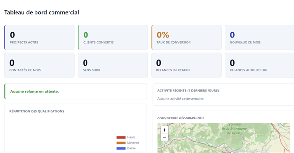
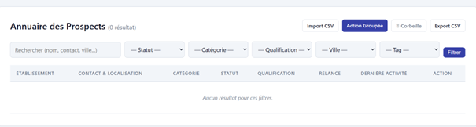
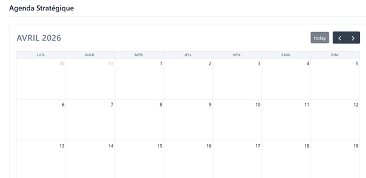

# CRM Commercial Open Source


[](https://discord.gg/8w7MeXby4T)

CRM léger pour la prospection commerciale. Développé en Python/Flask avec SQLite, sans dépendances lourdes.

---

| | | |
|---|---|---|
|  |  |  |

## Fonctionnalités

- Tableau de bord avec KPIs, pipeline de conversion et graphiques
- Annuaire des prospects avec filtres, tri, tags et pagination
- Fiche prospect avec historique, pièces jointes et export PDF
- Kanban par statut commercial
- Agenda avec relances automatiques (email récap à 8h)
- Mailing groupé avec variables de publipostage
- Cartographie des prospects (Leaflet / OpenStreetMap)
- Import / Export CSV
- Gestion multi-utilisateurs (admin / commercial)
- Protection CSRF, rate limiting, journaux de connexion
- Mode sombre / clair, version mobile responsive
- Conformité RGPD (opt-out, export JSON, registre des traitements)

---

## Installation

### Installation en une commande (recommandé)

Sur une Debian/Ubuntu fraîche, **même sans git** :

```bash
bash <(curl -fsSL https://raw.githubusercontent.com/Lucas-Luctek/Open_CRM/main/install.sh)
```

Le script installe automatiquement `git`, clone le dépôt, configure l'application et vous pose deux questions :
- **Mot de passe admin** — celui que vous utiliserez pour vous connecter
- **Port** — port d'écoute de l'application (5000 par défaut)

### Installation manuelle (si git est déjà installé)

```bash
git clone https://github.com/Lucas-Luctek/Open_CRM.git crm
cd crm
chmod +x setup.sh && ./setup.sh
```

### 3 — Démarrer le CRM

```bash
source venv/bin/activate
python app.py
```

Puis ouvrez votre navigateur sur **http://localhost:5000** (ou le port choisi).  
Login : `admin` / *(mot de passe choisi à l'installation)*

---

## Installation avec Docker

### Démarrage rapide

```bash
git clone https://github.com/Lucas-Luctek/Open_CRM.git crm
cd crm
ADMIN_PASSWORD=monmotdepasse docker compose up -d
```

L'application est accessible sur **http://localhost:5000**  
Login : `admin` / *(le mot de passe défini ci-dessus)*

### Changer le port hôte

```bash
HOST_PORT=8080 ADMIN_PASSWORD=monmotdepasse docker compose up -d
```

### Avec un fichier `.env`

```bash
cp .env.example .env
# Éditer .env :
nano .env
```

Ajouter dans `.env` :
```
ADMIN_PASSWORD=monmotdepasse
HOST_PORT=5000
SECRET_KEY=une-cle-secrete-aleatoire
COMPANY_NAME=MON ENTREPRISE
```

Puis :
```bash
docker compose up -d
```

### Commandes utiles

```bash
# Voir les logs
docker compose logs -f

# Arrêter
docker compose down

# Mettre à jour (nouvelle version)
git pull
docker compose up -d --build
```

Les données (base de données, fichiers uploadés, sauvegardes) sont conservées dans un volume Docker nommé `crm_data` — elles persistent entre les redémarrages et les mises à jour.

---

## Lancer en service systemd (démarrage automatique)

Pour que le CRM démarre automatiquement avec le serveur, créez `/etc/systemd/system/crm.service` :

```ini
[Unit]
Description=CRM Commercial
After=network.target

[Service]
User=VOTRE_USER
WorkingDirectory=/chemin/vers/crm
EnvironmentFile=/chemin/vers/crm/.env
ExecStart=/chemin/vers/crm/venv/bin/python app.py
Restart=always

[Install]
WantedBy=multi-user.target
```

```bash
sudo systemctl daemon-reload
sudo systemctl enable crm
sudo systemctl start crm
# Vérifier :
sudo systemctl status crm
# Voir les logs :
journalctl -u crm -n 50
```

---

## Configuration (fichier .env)

| Variable       | Description                      | Défaut |
|----------------|----------------------------------|--------|
| `SECRET_KEY`   | Clé secrète Flask (auto-générée) | —      |
| `PORT`         | Port d'écoute                    | 5000   |
| `COMPANY_NAME` | Nom affiché dans l'interface     | MON ENTREPRISE |
| `FLASK_DEBUG`  | Mode debug (false en prod)       | false  |

Le nom de l'entreprise, le logo et les couleurs peuvent aussi être changés à tout moment via **Admin > Personnalisation**.

---

## Structure du projet

```
crm/
├── app.py              # Application Flask principale
├── backup.py           # Script de sauvegarde
├── requirements.txt    # Dépendances Python
├── setup.sh            # Script d'installation
├── .env.example        # Modèle de configuration
├── static/             # CSS, favicon
├── templates/          # Vues HTML (Jinja2)
├── uploads/            # Pièces jointes (créé automatiquement)
└── backups/            # Sauvegardes automatiques de crm.db
```

---

## Sauvegarde

```bash
python backup.py
```

Les 30 dernières sauvegardes sont conservées dans `backups/`. Une sauvegarde automatique tourne chaque nuit à 2h.

---

## Dépendances CDN (nécessite internet)

Chart.js · Leaflet · FullCalendar · Google Charts · html2canvas · jsPDF · API adresse.data.gouv.fr

---

## Licence

[GPL v3](LICENSE) — Libre d'utilisation et de modification. Toute redistribution doit rester sous la même licence open source.
